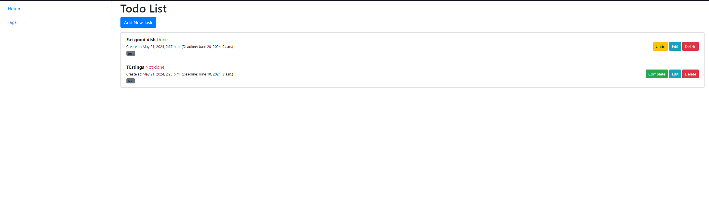
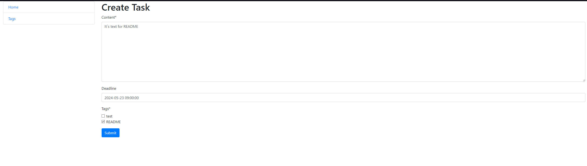
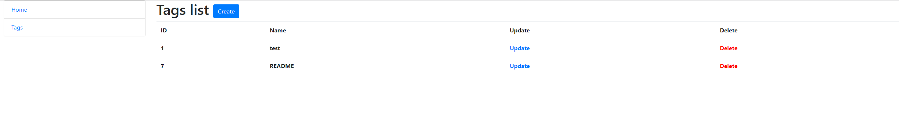
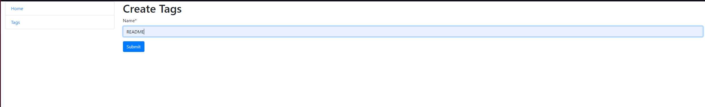

# Todo List Project

This project is a simple task list that allows users to create, view, update, and delete tasks. Each task can be marked as done or undone, and can also have a deadline and tags.

## Installation

1. Clone this repository to your local machine.
2. Create a virtual environment and activate it.
3. Install the dependencies using `pip install -r requirements.txt`.
4. Run database migrations using `python manage.py migrate`.
5. Start the development server using `python manage.py runserver`.

## Usage

1. Open your browser and navigate to `http://localhost:8000/`.
2. Select "Add Task" to create a new task.
3. Browse, update, or delete tasks using the respective links on the page.
4. Mark tasks as done or undone by clicking the appropriate buttons.

## Photo pages

1. Home pages is Task list

2. Task create

3. Tags page

4. Tags create
